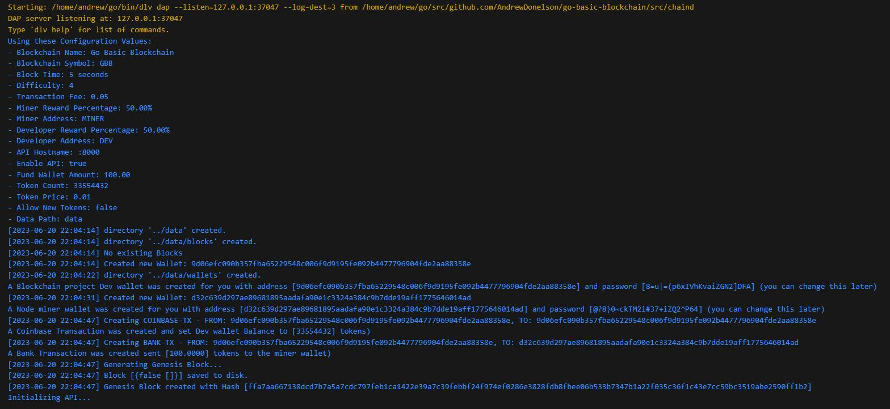

# go-basic-blockchain

## Educational Blockchain Implementation in Go

Welcome to go-basic-blockchain, an educational project designed to demystify blockchain technology through a hands-on, from-scratch implementation in Go. This project serves as a comprehensive learning tool for developers, students, and blockchain enthusiasts who want to understand the fundamental mechanics of blockchain systems.

Key Features:
- Built from Scratch: Every component of this blockchain is implemented from the ground up, without relying on third-party blockchain libraries like go-ethereum or bitcoin. This approach ensures a deep understanding of each blockchain element.
- Go Programming Language: Utilizing Go's simplicity and efficiency, this project demonstrates how to build complex systems with a clean, readable codebase.
- Readable JSON Format: We've chosen to use human-readable JSON for data structures and storage, making it easier for learners to inspect and understand the blockchain's state at any given time.
- No Third-Party Dependencies: By avoiding external blockchain libraries, we encourage learners to think through and implement core blockchain concepts themselves, fostering a deeper understanding of the technology.
- Educational Focus: Each component is thoroughly commented and documented, explaining not just the how, but the why behind design decisions and implementations.

## Learning Objectives:

- Understand the fundamental structure of a blockchain
- Implement core blockchain components: blocks, transactions, wallets, and mining
- Explore consensus mechanisms and proof-of-work algorithms
- Learn about cryptographic principles used in blockchain technology
- Gain insights into blockchain data structures and their implementations

## Who is this for?

This project is ideal for:

- Software developers looking to expand their blockchain knowledge
- Computer science students studying distributed systems and cryptography
- Blockchain enthusiasts who want to peek under the hood of blockchain technology
- Anyone interested in understanding how blockchain works at a fundamental level

By exploring this codebase, you'll gain hands-on experience with blockchain concepts, preparing you to work with or develop more complex blockchain systems in the future. Whether you're looking to contribute to existing blockchain projects or innovate with your own, this educational implementation provides the foundational knowledge you need.
Let's dive in and start building a blockchain from the ground up!

Here is a current screenshot of a debug session:

## Unleashing the Power of Dynamic Transactions in Blockchain: The Future of Digital Interactions

The rise of blockchain technology has transformed the landscape of the digital world, promising to redefine the paradigms of trust, security, and efficiency in transactions. At the heart of this evolution lies an innovative concept known as dynamic transactions. This blockchain feature could unlock a whole new realm of applications if thoroughly expanded upon, effectively transcending the constraints of traditional static transactions. 

### The Essence of Dynamic Transactions

In a conventional blockchain, transactions are fundamentally static. This implies that once they are embedded within the blockchain, they cannot be altered or interacted with. This immutability provides security and transparency but also limits the blockchain's potential applications.

Dynamic transactions aim to overcome these limitations by introducing an element of interaction. Unlike their static counterparts, dynamic transactions can adjust their state according to predefined conditions, incorporating real-time data inputs from off-chain or on-chain sources.

This dynamism translates to transactional units that are not just a record of a past event, but living entities that continuously interact and evolve within the blockchain ecosystem. They have the potential to react to external triggers, modify their own state, and influence the state of other transactions.

### Dynamic Transactions: A Game Changer 

The implications of dynamic transactions in blockchain technology are multitudinous. Their transformative power lies in their potential to enable complex, programmable, and adaptive systems on the blockchain.

#### 1. Smart Contracts and Beyond

The initial use case for dynamic transactions can be traced back to smart contracts. These self-executing contracts with the terms of the agreement directly written into lines of code have been revolutionary in automating trustless, decentralized applications. However, dynamic transactions can take smart contracts to the next level by enabling them to incorporate real-world data and act upon it dynamically.

For example, an insurance smart contract could not only disburse funds when a triggering event (like a natural disaster) occurs, but it could also dynamically adjust the payout amount based on the severity of the disaster, gathered from real-world data feeds.

#### 2. Real-world Integrations and IoT

The potential for real-world integrations makes dynamic transactions incredibly powerful. Consider Internet of Things (IoT) devices: these devices generate vast amounts of data, and integrating this data with blockchain has always been a challenge. Dynamic transactions could provide a solution, by acting as a bridge between these IoT devices and the blockchain. The transactions could adjust dynamically based on the data input from the devices, providing a powerful tool for real-time, secure, and decentralized data management.

#### 3. Compliance and Governance

Dynamic transactions can play a crucial role in maintaining compliance and governance in blockchain systems. For instance, dynamic transactions could be used to ensure that transactions comply with evolving regulations by dynamically adjusting their parameters based on the current regulatory framework. This could potentially revolutionize fields such as decentralized finance (DeFi), where regulatory compliance is a major challenge.

### The Potential of Dynamic Transactions

The full potential of dynamic transactions in blockchain is yet to be realized. As the technology continues to evolve, we might witness dynamic transactions being used to create complex, adaptive, and self-governing systems, pushing the boundaries of what we currently perceive as possible in the blockchain world.

Imagine a future where a blockchain system could evolve its own rules based on real-world data, creating a truly autonomous, decentralized ecosystem. Or consider a world where blockchain could interact seamlessly with other technologies like AI and IoT, leveraging the power of dynamic transactions.

Dynamic transactions present a fascinating opportunity to expand the applications of blockchain technology. They have the potential to transform the digital landscape, creating a more secure, efficient, and adaptive digital future. It’s only a matter of time until we see how dynamic transactions are used to fully unleash the power of the blockchain.

## How to run

1. Clone the repo
2. Run `go mod tidy`
3. Run `go run main.go` in the root directory

## What is currently included

- [x] Basic Blockchain
- [x] Proof of Work
- [x] Transactions
- [x] Dynamic In memory Transaction Lookup
- [x] Wallets
- [x] Mining Rewards
- [ ] Network (pending)
- [ ] Consensus (pending)
- [x] Persistence
- [ ] CLI (pending)
- [x] Web Interface
- [x] Makefile (build, run, test, etc)
- [x] Docker
- [x] Tests
- [ ] Documentation (last priority)

## What is a Blockchain

A blockchain is a growing list of records, called blocks, that are linked together using cryptography. Each block contains a cryptographic hash of the previous block, a timestamp, and transaction data (generally represented as a Merkle tree).

By design, a blockchain is resistant to modification of its data. This is because once recorded, the data in any given block cannot be altered retroactively without alteration of all subsequent blocks. For use as a distributed ledger, a blockchain is typically managed by a peer-to-peer network collectively adhering to a protocol for inter-node communication and validating new blocks. Once recorded, the data in any given block cannot be altered retroactively without alteration of all subsequent blocks, which requires consensus of the network majority. Although blockchain records are not unalterable, blockchains may be considered secure by design and exemplify a distributed computing system with high Byzantine fault tolerance. Decentralized consensus has therefore been claimed with a blockchain.

## What is a Block

A block is a container data structure that aggregates transactions for inclusion in the public ledger, the blockchain. The block is made up of a header, containing metadata, followed by a long list of transactions that make up the bulk of its size.

## What is a Transaction

A transaction is a transfer of Bitcoin value that is broadcast to the network and collected into blocks. A transaction typically references previous transaction outputs as new transaction inputs and dedicates all input Bitcoin values to new outputs. Transactions are not encrypted, so it is possible to browse and view every transaction ever collected into a block. Once transactions are buried under enough confirmations they can be considered irreversible.

## What is a Wallet

A wallet is a collection of private keys that correspond to addresses. A private key is a secret number that allows Bitcoins to be spent. If a wallet’s private key is lost, the wallet loses its money. A wallet’s private keys are secret codes. Only the owner of the private key can send cryptocurrency. With no private key, a wallet cannot spend cryptocurrency. Therefore, it is very important to keep the private key safe.

## What is a Mining Reward

A mining reward is the amount of new cryptocurrency that is awarded to the miner of a block. It is part of the consensus algorithm in blockchains and is the incentive that miners have to mine on a given blockchain. The reward for mining a block is currently 6.25 Bitcoin.

## What is a Network

A network is a group of computers that are connected to each other for the purpose of communication. Networks may be classified according to a wide variety of characteristics. This article provides a general overview of types and categories and also presents the basic components of a network.

## What is Consensus

Consensus is a process that is used to achieve agreement on a blockchain network. Consensus enables network participants to agree on the contents of the blockchain in a distributed and trust-less manner. ... Consensus is reached through a majority vote of the network participants.

## What is Persistence

Persistence is the continuance of an effect after its cause is removed. In the context of blockchain, persistence is the ability to store data in a permanent state. This is achieved by storing data on a hard drive or other non-volatile storage medium.

## What is a CLI

A CLI is a command-line interface (CLI) processes commands to a computer program in the form of lines of text. The program which handles the interface is called a command-line interpreter or command-line processor. Operating systems implement a command-line interface in a shell for interactive access to operating system functions or services. Such access was primarily provided to users by computer terminals starting in the mid-1960s, and continued to be used throughout the 1970s and 1980s on VAX/VMS, Unix systems and personal computer systems including DOS, CP/M and Apple DOS.

## What is a Web Interface

A web interface is a system that allows users to interact with a web server from within their browser. Web interfaces have become increasingly common over the last decade as web browsers have become more powerful and the number of people with access to the internet has increased.

## What is Docker

Docker is a set of platform as a service (PaaS) products that use OS-level virtualization to deliver software in packages called containers. Containers are isolated from one another and bundle their own software, libraries and configuration files; they can communicate with each other through well-defined channels. All containers are run by a single operating system kernel and are thus more lightweight than virtual machines. Containers are created from images that specify their precise contents. Images are often created by combining and modifying standard images downloaded from public repositories.

## What is Testing

Testing is the process of evaluating a system or its component(s) with the intent to find whether it satisfies the specified requirements or not. In simple words, testing is executing a system in order to identify any gaps, errors, or missing requirements in contrary to the actual requirements.
